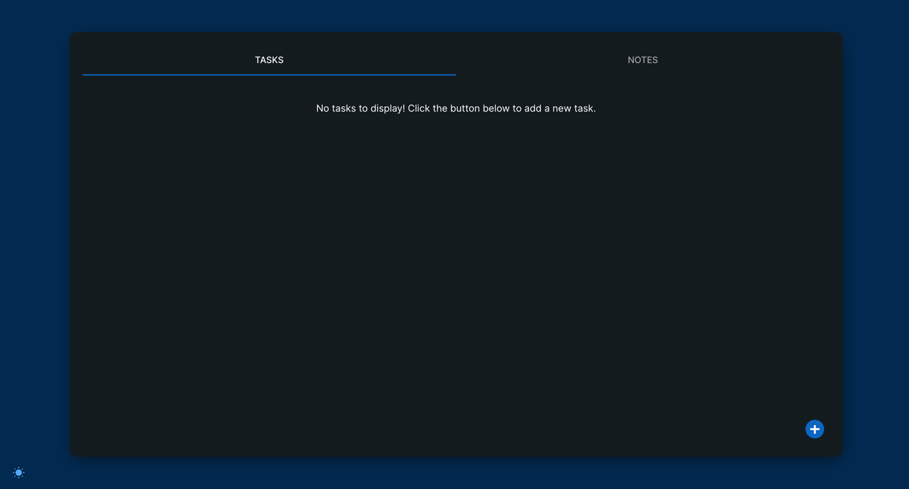
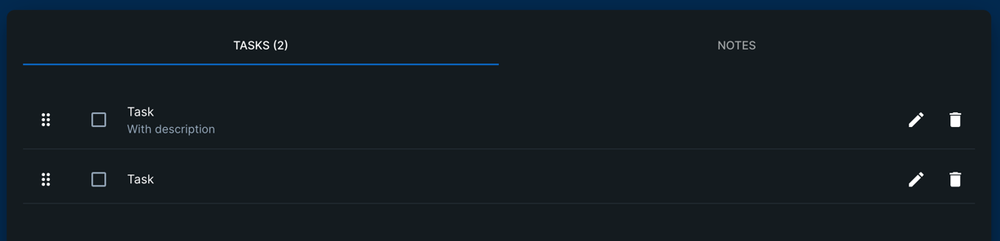
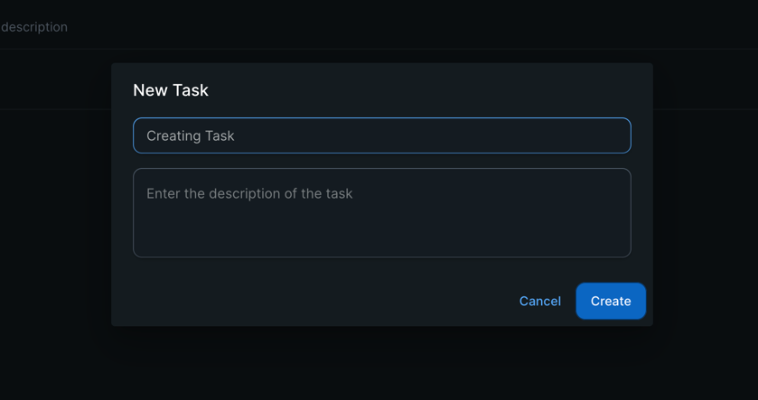
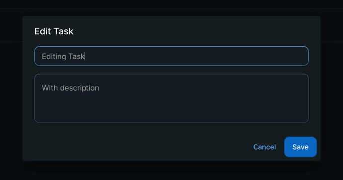
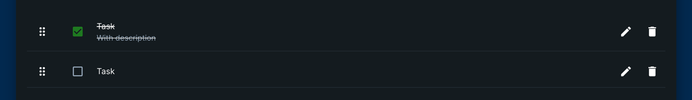
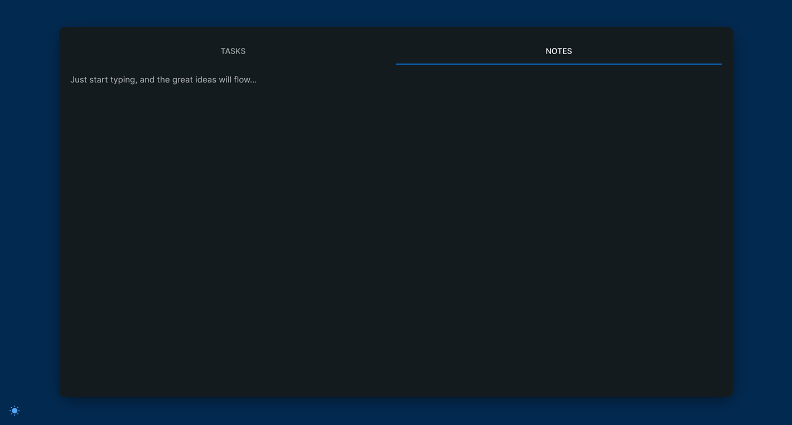
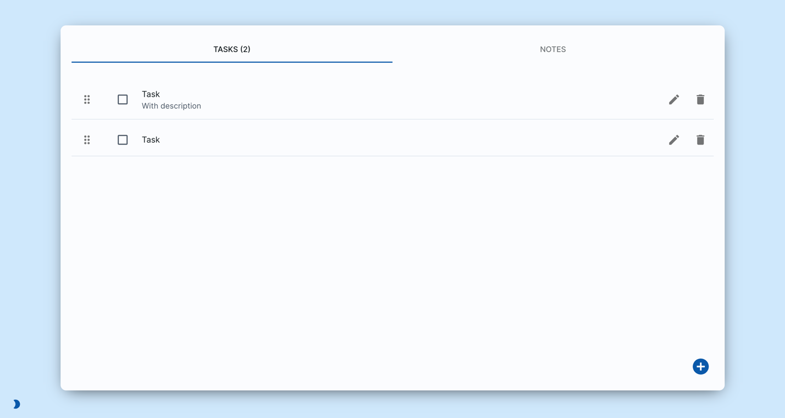
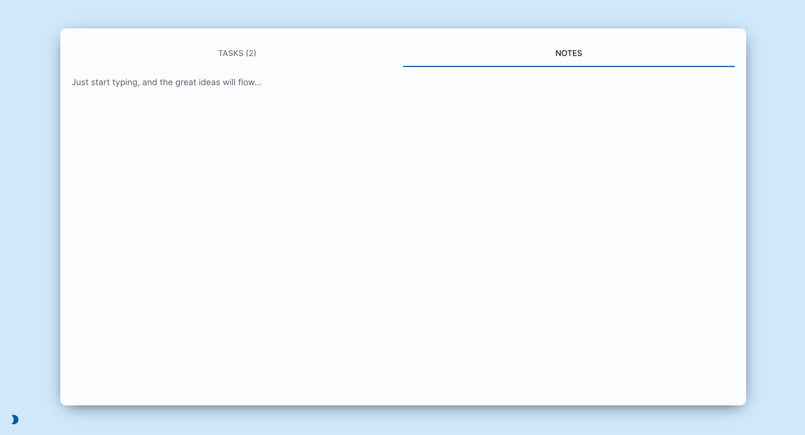

# Oranged! 🍊

Oranged! is a modern, feature-rich Google Chrome extension that helps you stay organized and productive. It replaces your new tab page with a beautifully designed interface featuring a task manager and note-taking capabilities, putting productivity tools right at your fingertips.

## 🚀 Features

### ✅ Task Management
- **Create, edit, and delete tasks** with an intuitive interface
- **Mark tasks as complete** with satisfying visual feedback
- **Drag and drop reordering** for task prioritization
- **Persistent storage** using Chrome's storage API
- **Real-time updates** across all new tab instances







### 📝 Note Taking
- **Rich text notes** for capturing ideas and information
- **Auto-save functionality** to prevent data loss
- **Seamless switching** between tasks and notes



### 🎨 Theme Support
- **Light and dark themes** for comfortable viewing in any environment
- **System preference detection** and manual toggle
- **Consistent theming** across all components




## 🛠️ Tech Stack

### Frontend
- **React 18** with TypeScript for type-safe component development
- **Material-UI (MUI) v5** for consistent, accessible UI components
- **React DnD** for drag-and-drop functionality
- **Emotion** for CSS-in-JS styling

### Build Tools & Bundling
- **Webpack 5** with custom configuration for Chrome extension development
- **Babel** for JavaScript/TypeScript transpilation
- **PostCSS & Tailwind CSS** for utility-first styling
- **TypeScript** for enhanced developer experience and type safety

### Testing & Quality
- **Jest** with React Testing Library for comprehensive unit testing
- **ESLint** with TypeScript support for code quality
- **Type checking** with TypeScript compiler
- **Coverage reporting** integrated with CI/CD

### Development Tools
- **Chrome Extension Manifest V3** for modern extension standards
- **Hot reloading** in development mode
- **Source maps** for debugging
- **Automated builds** with GitHub Actions

## 📦 Installation

### For Users

1. **Download the latest release** from the [releases page](https://github.com/jeremybacher/oranged/releases)
2. **Extract the ZIP file** to a local directory
3. **Install in Chrome**:
   - Open Chrome and navigate to `chrome://extensions/`
   - Enable **Developer Mode** using the toggle in the top-right corner
   - Click **"Load unpacked"** and select the extracted folder containing the extension files
   - Open a new tab and start organizing! 🎉

### For Developers

For development setup, see the [Development](#-development) section below.

## 🏗️ Architecture

### Project Structure
```
oranged/
├── src/                          # Source code
│   ├── components/              # React components
│   │   ├── tasks/              # Task management components
│   │   ├── context/            # React Context providers
│   │   ├── hooks/              # Custom React hooks
│   │   ├── themes/             # Theme configuration
│   │   └── types/              # TypeScript type definitions
│   ├── App.tsx                 # Main application component
│   └── index.tsx               # Application entry point
├── public/                     # Static assets
│   ├── manifest.json          # Chrome extension manifest
│   └── background.js          # Service worker
├── assets/                     # Documentation images
├── .github/workflows/         # CI/CD configurations
└── dist/                      # Built extension (generated)
```

### Key Components

- **`App.tsx`**: Main application with theme provider and error boundary
- **`TasksContext`**: Global state management for tasks using React Context
- **`useStorage`**: Custom hook for Chrome storage API integration
- **`DraggableItem`**: Drag-and-drop functionality for task reordering
- **`ErrorBoundary`**: Error handling and graceful degradation

### Data Flow

1. **User interactions** trigger React component state changes
2. **Context providers** manage global state (tasks, theme preferences)
3. **Custom hooks** handle Chrome storage API calls
4. **Background script** manages extension lifecycle events

## 💻 Development

### Prerequisites
- **Node.js** (v18 or v20)
- **npm** (included with Node.js)
- **Git** for version control
- **Google Chrome** for testing

### Getting Started

1. **Clone the repository**:
   ```bash
   git clone https://github.com/jeremybacher/oranged.git
   cd oranged
   ```

2. **Install dependencies**:
   ```bash
   npm install
   ```

3. **Run the development build**:
   ```bash
   npm run dev
   ```
   This starts Webpack in watch mode for hot reloading during development.

4. **Load the extension in Chrome**:
   - Open `chrome://extensions/`
   - Enable Developer Mode
   - Click "Load unpacked" and select the `dist` folder

### Available Scripts

| Command | Description |
|---------|-------------|
| `npm run dev` | Start development build with watch mode |
| `npm run build` | Create production build for distribution |
| `npm test` | Run unit tests with Jest |
| `npm run test:watch` | Run tests in watch mode |
| `npm run test:coverage` | Generate test coverage reports |
| `npm run lint` | Check code quality with ESLint |
| `npm run lint:fix` | Fix auto-correctable ESLint issues |
| `npm run type-check` | Validate TypeScript types |

### Development Workflow

1. **Make changes** to source files in `src/`
2. **Webpack automatically rebuilds** the extension (if using `npm run dev`)
3. **Reload the extension** in Chrome (`chrome://extensions/` → reload button)
4. **Test changes** by opening a new tab
5. **Run tests** to ensure functionality: `npm test`
6. **Check types and linting** before committing: `npm run type-check && npm run lint`

### Testing

The project uses **Jest** and **React Testing Library** for comprehensive testing:

```bash
# Run all tests
npm test

# Run tests in watch mode (recommended during development)
npm run test:watch

# Generate coverage report
npm run test:coverage
```

Test files are located alongside source files with `.test.tsx` or `.test.ts` extensions.

### Building for Production

To create a production build for Chrome Web Store submission:

```bash
npm run build
```

This generates optimized files in the `dist/` directory, ready for packaging and distribution.

### 🔄 CI/CD Pipeline

This project uses **GitHub Actions** for automated testing, building, and releases:

#### CI Workflow (`.github/workflows/ci.yml`)
- **Triggers**: Every push and pull request to `main` and `develop` branches
- **Node.js versions**: 18.x and 20.x (matrix strategy)
- **Quality checks**:
  - ✅ TypeScript type checking (`npm run type-check`)
  - ✅ ESLint code quality (`npm run lint`)
  - ✅ Jest unit tests (`npm test`)
  - ✅ Test coverage reporting (`npm run test:coverage`)
  - ✅ Production build verification (`npm run build`)
- **Coverage**: Automatically uploaded to Codecov

#### Release Workflow (`.github/workflows/release.yml`)
- **Triggers**: Git tags matching pattern `v*.*.*` (e.g., `v1.0.0`)
- **Requirements**: All CI checks must pass
- **Automated process**:
  1. 🧪 Runs complete test suite
  2. 🏗️ Creates production build
  3. 📦 Generates ZIP file for Chrome Web Store
  4. 🚀 Creates GitHub release with build artifacts
  5. 📝 Auto-generates release notes

#### Branch Protection
- **Protected branches**: `main`
- **Requirements**: 
  - All status checks must pass
  - Up-to-date with base branch
  - No force pushes allowed

### 🚀 Creating a Release

To publish a new version:

1. **Update version** in `package.json` and `public/manifest.json`:
   ```bash
   # Example: updating to version 1.1.0
   npm version patch  # or minor/major
   ```

2. **Commit version bump**:
   ```bash
   git add .
   git commit -m "chore: bump version to v1.1.0"
   git push origin main
   ```

3. **Create and push version tag**:
   ```bash
   git tag v1.1.0
   git push origin v1.1.0
   ```

4. **Automated release**: GitHub Actions will:
   - ✅ Run all tests and quality checks
   - 🏗️ Build the extension
   - 📦 Create downloadable ZIP file
   - 🚀 Publish GitHub release

**Note**: Releases are only created if all tests pass, ensuring quality control.

### 🤝 Contributing

We welcome contributions! Please follow these guidelines:

1. **Fork the repository** and create a feature branch
2. **Write tests** for new functionality
3. **Ensure all checks pass**: `npm run type-check && npm run lint && npm test`
4. **Submit a pull request** with a clear description of changes
5. **Wait for CI** to validate your changes

### 📋 Code Standards

- **TypeScript**: Strict mode enabled for type safety
- **ESLint**: Enforced code style and best practices
- **React**: Functional components with hooks
- **Testing**: Minimum 80% test coverage goal
- **Commits**: Follow conventional commit format

### 🐛 Debugging

#### Common Issues

1. **Extension not loading**: Check console for build errors
2. **Storage not persisting**: Verify Chrome permissions in manifest
3. **Hot reload not working**: Restart webpack dev server
4. **Type errors**: Run `npm run type-check` for detailed information

#### Debug Tools

- **React DevTools**: Install Chrome extension for component inspection
- **Chrome DevTools**: Use for debugging background scripts and storage
- **Source Maps**: Available in development builds for debugging

## 📄 License

This project is open source and available under the ISC License.

## 🙋 Support & Feedback

- **Bug reports**: [Create an issue](https://github.com/jeremybacher/oranged/issues/new)
- **Feature requests**: [Create an issue](https://github.com/jeremybacher/oranged/issues/new)
- **Questions**: [Start a discussion](https://github.com/jeremybacher/oranged/discussions)

---

Made with ❤️ by [Jeremy Bacher](https://x.com/jeremybacher)
